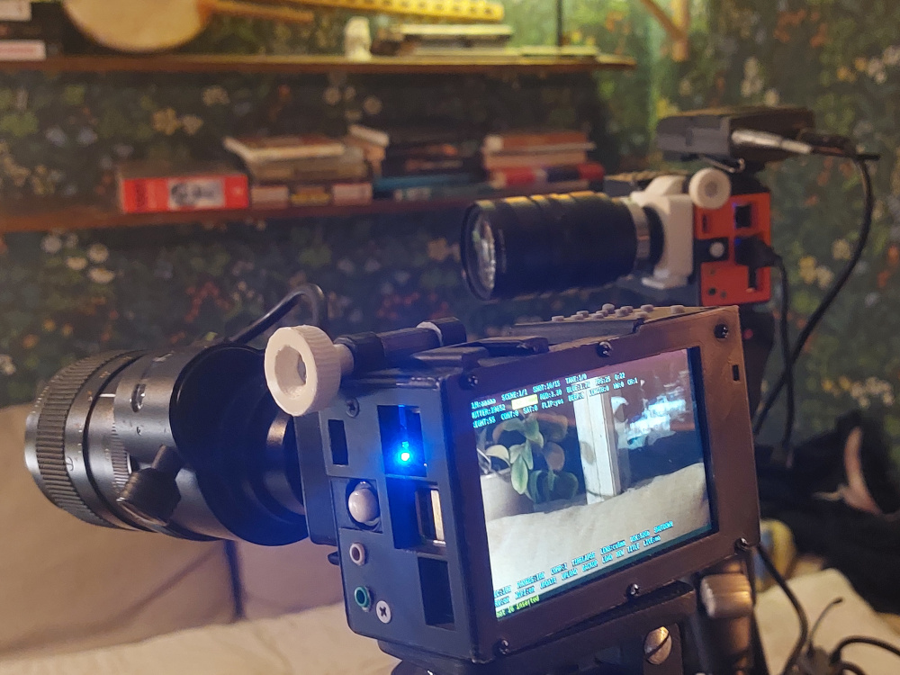
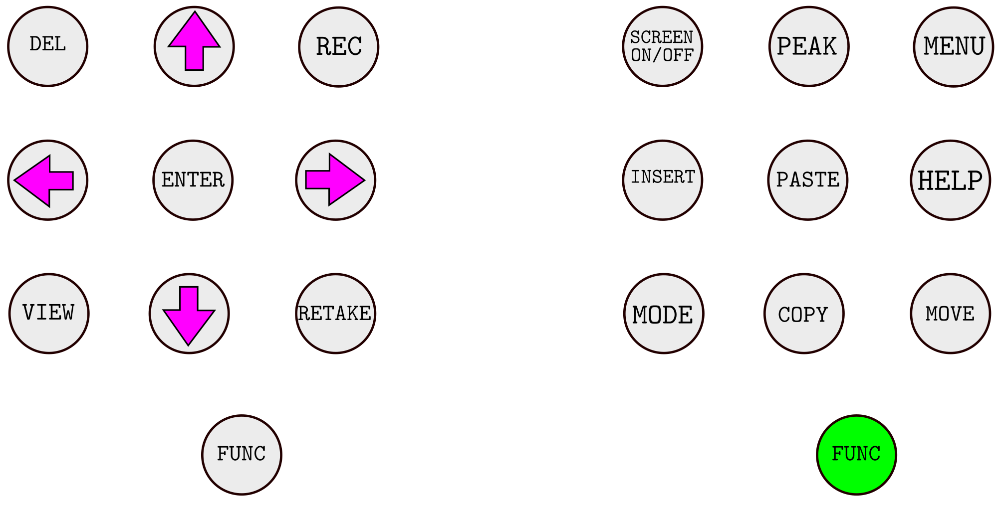
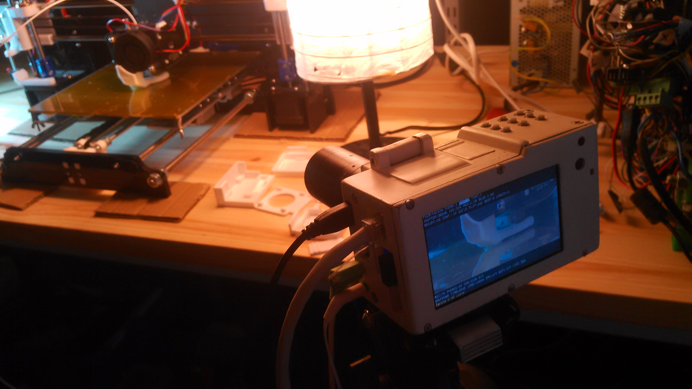

Tarina Retake
=============
The Filmmaking Device

Let's introduce this thing with a thing it made, [a film on youtube](https://youtu.be/Yl2oAxMtDV0?si=lXOYTpkJi1YFuO2u) !



Hollywood in your palms
--------------------------
Retake shots on the spot and see movie making magic in the filmmaking interface that runs Tarina Retake.
 
Software
--------
A video camera with *most of* the tools to make a film within the camera. That means alot of features. So far we have these key features running.
- glue the selected clips together and/or cutting them.
- making timelapses, voiceover, music track recording, slo-mo recording, fast-forward recording
- cut and copy and move clips around
- backup to usb harddrive or your own server
- upload or stream to youtube or your own server
- auto correction can easily be switched on or off for shutter, iso and colors so *operator* is in full control also for audio levels
- connect many Tarinas together for multicamera shooting
- stream a film a take or a scene through the network
- control the camera with silent physical buttons or a usb-wireless-keyboard or through https or ssh or ports, you choose.

It's all in there. But, where? in the filmmaking interface, that is Tarina.

Hardware
--------
The parts have been chosen on the basis of features, quality, openness, availabilty and price. One of the key ideas of the project is to have a camera that could be upgraded or repaired by the fact that you easily just switch a component. The casis of the camera is 3d printable with a flipping gonzo style 180 shooting mode, please take a look [here to get the picture](https://github.com/rbckman/tarina/tree/master/3d)

### Buttons


Here's the main components: 

[Raspberry Pi 3 B](https://www.raspberrypi.org/products/raspberry-pi-3-model-b/)<br>
[Raspberry Pi High Quality Camera](https://www.raspberrypi.org/products/raspberry-pi-high-quality-camera/?resellerType=home) or <br>
[Pimoroni Hyperpixel 4 inch screen](https://learn.pimoroni.com/tutorial/sandyj/getting-started-with-hyperpixel-4)
[USB via vt1620a Sound card](https://www.aliexpress.com/item/Professional-External-USB-Sound-Card-Adapter-Virtual-7-1-Channel-3D-Audio-with-3-5mm-Headset/32588038556.html?spm=2114.01010208.8.8.E8ZKLB)<br>
[3.7v 7800mAh li-ion Battery](https://www.aliexpress.com/item/3-7v-9000mAh-capacity-18650-Rechargeable-lithium-battery-pack-18650-jump-starter/32619902319.html?spm=2114.13010608.0.0.XcKleV)<br>
[Type-C 5v 2A 3.7V Li-ion battery charger booster module](https://www.ebay.com/itm/Type-C-USB-5V-2A-3-7V-18650-Lithium-Li-ion-Battery-Charging-Board-Charger-Module/383717339632?var=652109038482)
[Buttons](http://www.ebay.com/itm/151723036469?_trksid=p2057872.m2749.l2649&ssPageName=STRK%3AMEBIDX%3AIT) connected to a [MCP23017-E/SP DIP-28 16 Bit I / O Expander I2C](http://www.ebay.com/sch/sis.html?_nkw=5Pcs+MCP23017+E+SP+DIP+28+16+Bit+I+O+Expander+I2C+TOP+GM&_trksid=p2047675.m4100)

Check [MANUAL](docs/tarina-manual.md) for complete part list & build instructions

[Ready to print 3d designs](https://github.com/rbckman/tarina/tree/master/3d)

Installing
----------
Download [Raspbian buster (not the latest!)](https://www.raspberrypi.org/downloads/raspbian/) and follow [install instructions | a simple install script should take care of it all!](https://www.raspberrypi.org/documentation/installation/installing-images/README.md).
[Ssh into](https://www.raspberrypi.org/documentation/remote-access/ssh/) Raspberry Pi and run:
```
sudo apt-get install git
```
Go to /home/pi/ folder
```
cd /home/pi
```
Git clone tarina and then run install script with sudo:
```
git clone https://github.com/rbckman/tarina.git
cd tarina
sudo ./install.sh
```
You'r ready to rumble:
```
python3 tarina.py
```

Why
---
There are several reasons why.

- be able to repair if something breaks (this has been prooven as a very nice feature)
- be able to expand / build on it / make modifications
- be able to connect to it / program it to do things
- do a film on the fly without the need of another computer
- be able to watch your film directly on a screen once you're done filming
- learn about programming and your own crafts to really get down to the nitty-gritty. 

Connect
-------
Matrix [#tarina:matrix.tarina.org](https://riot.im/app/#/room/#tarina:matrix.tarina.org)

Mail rob(at)tarina.org

Standing on the shoulders of forward thinking, freedom loving generous people (powa to da people!)
--------------------------------------------------------------------------------------------------
This whole project has only been possible because of the people behind the free and open source movement. Couldn't possible list all of the projects on which shoulders this is standing for it would reach the moon. A big shout out to all of ya!! Yall awesome!

[Gnu](https://gnu.org), [Linux](https://github.com/torvalds/linux), [Debian](https://debian.org), [Raspberry Pi](https://raspberrypi.org), 
[Python programming language](https://python.org), Dave Jones's [Picamera python module](https://github.com/waveform80/picamera), rwb27 for lens shading correction! Check out the 3d printable microscope [Openflexure](https://github.com/rwb27/openflexure_microscope), [FFmpeg](https://ffmpeg.org/), [Libav-tools](https://libav.org/), [GPac library with MP4Box](https://gpac.wp.imt.fr/mp4box/), [Blender](http://blender.org), [aplay the awesome wav player/recorder with VU meter](http://alsa.opensrc.org/Aplay), [Popcornmix's Omxplayer](https://github.com/popcornmix/omxplayer), [Will Price's Python-omxplayer-wrapper](https://github.com/willprice/python-omxplayer-wrapper), [SoX - Sound eXchange](http://sox.sourceforge.net/), [The Dispmanx library](https://github.com/raspberrypi/userland/tree/master/host_applications/linux/apps/hello_pi), [Blessed](http://blessed.readthedocs.io/),  [web.py](http://webpy.org), [Tokland's youtube-upload](https://github.com/tokland/youtube-upload)



Some films made with Tarina
----------------------

### [Aakenustunturi Hiihtoretki 2023](https://youtu.be/VB7R2Eiw13k)

### [Mancherok](https://youtu.be/jmy0W6rA10Q)

### [Robins Trägård](https://youtu.be/IOZAHCIN6U0)

### [A new years medley](https://youtu.be/BYojmnD-1eU)

### [Landing Down Under](https://www.youtube.com/watch?v=Lbi9_f0KrKA)

### [Building Tarina](https://youtu.be/7dhCiDPssR4)

### [Mushroom Season](https://youtu.be/ggehzyUThZk)
